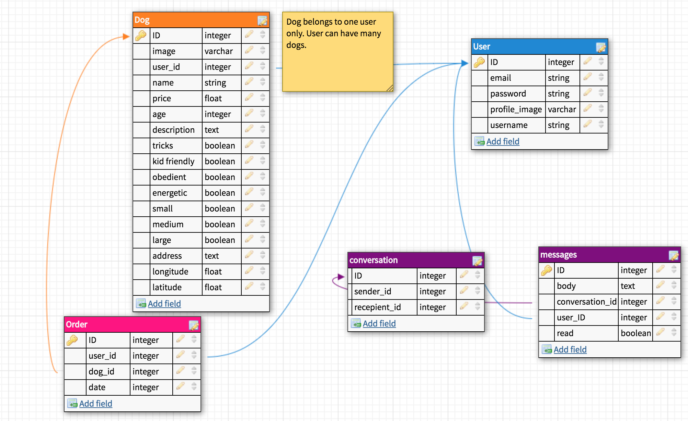

# AirPupper

## Overview

* [Project brief](#project-brief)
* [Problem](#problem)
* [Solution](#solution)
* [Technology stack](#technology-stack)
* [Concept, Design & Build](#concept-design-build)
  * [Concept](#concept)
  * [Design](#design)
  * [Build](#build)
* [User stories](#user-stories)
* [Wireframe](#wireframe)
* [Back-end: DB schema design](#back-end)
* [Style guide](#style-guide)
  * [CSS](#css)
  * [Colours](#colours)
  * [Font Style](#font-style)
  * [Graphics](#graphics)
* [Setup](#setup)
* [Deployment](#deployment)
* [Outstanding Issues](#outstanding-issues)

## Project Brief

Design, build, deploy and present a two sided marketplace. This app will cater to two markets that the app brings together (e.g. Ebay with buyers & sellers, AirBnB with travellers & house owners, Uber with travellers & drivers).

[Return to overview](#overview)

## Problem

There are millions of people who looove dogs and would love to play with them or just hang out with a dog but are unable adopt any as a companion for various reasons such as lack of time, not having a suitable home for the dog, or financial inability.

Then there are those who are fortunate enough to have dog(s) but don't have enough time or are too tired to take them out for their daily exercise after coming home from work. Currently, these dog owners can solve this problem by hiring dog walkers or dog sitters for a fee which can get expensive over the long term.

[Return to overview](#overview)

## Solution

The solution for both of these groups is AirPupper! This app provides a platform for dogless dog-lovers to rent a dog for a fee set by the dog-owner.

The dog owners can upload pictures of their dogs and set a price per hour. The other users can go on the app and scroll through a list of dogs available and can "book" a dog through the app. Specific arrangements can be made between users through the app's internal messaging system.

With this app, the dogless people can hang out with a dog whenever they want without having to take care of one and dog owners don't have to pay through the nose to get their dog's daily exercise, but instead make some extra cash from it. This is the primary service of the app.

The secondary service is connecting dog owners to go on doggy dates. Dog owners can browse other dogs to "rent" for a few hours for own dog to have a companion to play with.

[Return to overview](#overview)

## Technology Stack

Front-end:
* HTML, CSS, Bootstrap  

Back-end:
* Ruby on Rails

[Return to overview](#overview)

## Concept, Design and build

To kick off the project, I talked to key stakeholders to determine the requirements and expectations for the project. After gathering the information, I went ahead to create a low fidelity sketch of the dog renting platform.

[Return to overview](#overview)

### Concept

I drew low fidelity sketches on a whiteboard and concentrated on mobile first design.
Concepts include:
* A button to create a new listings of dogs
* A list to display existing dogs, and what information to include (key dog details, photos)
* Information divided into different pages of the platform (e.g. location, price)

[Return to overview](#overview)

### Design

Next I used Figma to create high fidelity designs of my hand drawn concepts and further refine the user interface.

[Return to overview](#overview)

### Build

I built the MVP in Rails. Using Bootstrap with Rails as well as various icon providers like Font Awesome.

[Return to overview](#overview)

## User stories

User stories can be found [here](https://trello.com/b/pEzn2BLx/airpupper).

Timeline of tasks were also defined within the same Trello.

[Return to overview](#overview)

## Wireframe

The wireframe can be found [here](https://www.figma.com/file/HD815GS7VpxNAl14yATSUXK7/Pupper).

[Return to overview](#overview)

## Back-end

As for the backend, we have planned the DB schema as follows to serve as a reference when building the backend Rails server.

[Return to overview](#overview)

## Style Guide

### CSS

The decision was made to use Bootstrap due to its ease of use and existing components (such as buttons, cards, forms). I believe that this widely used framework will enhance the user experience.

[Return to overview](#overview)

### Colours

Colours selected for the app were based on feel.
From this, the theme was created with complementary shades for an unobtrusive and clear user experience.

Item | Colour | RGB | Hex  
---: | -----:| -----:| ---
Primary 1 |  | 251,218,97 | #FBDA61   
Secondary 1 |  | 255,176,229 | #FFB0E5
Secondary 2 |  | 227,248,255 | #E3F8FF
Font |  | 0,0,0,0.70 | #000000

[Return to overview](#overview)

### Font Style

I wanted to present a cleanly designed style so it's easy for users to access content. To do this, only one font was selected for everything because I wanted everything to be uniform and prevents the app from becoming too busy with changing fonts. I chose a popular sans-serif font, RALEWAY, available from [Google Fonts](https://fonts.google.com/specimen/Raleway). I chose RALEWAY because it's a simple, clean font. I set the opacity of the font to 0.7 so it doesn't stand too boldly against the background.

[Return to overview](#overview)

### Graphics

Icons were taken from [Font Awesome](http://fontawesome.io/icons/). Font awesome was chosen due to its minimal and flat design to prevent the app appearing too cluttered for better user experience.

[Return to overview](#overview)

## Setup

Clone the repo:

`$ git clone https://github.com/moiscraycray/AirPupper.git`

Then run:

`$ bundle install`

Then run:

`$ rails db:migrate`

Then run the server:

`$ rails s`

[Return to overview](#overview)

## Deployment

If deploying to Heroku, remember to run:

`$ heroku run rails db:migrate`

[Return to overview](#overview)

## Outstanding Issues

Please see [issues](https://github.com/moiscraycray/AirPupper/issues) for existing bugs with the app.

[Return to overview](#overview)
